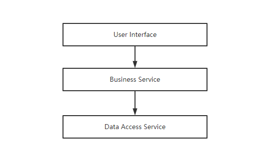
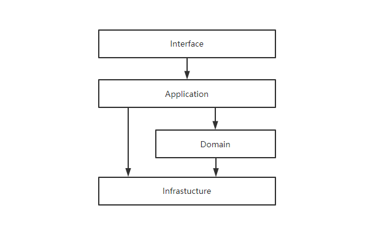
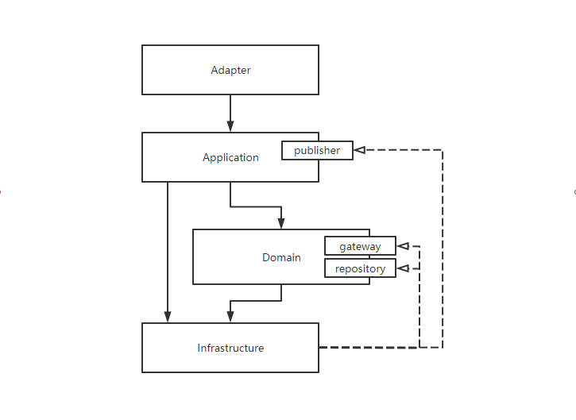
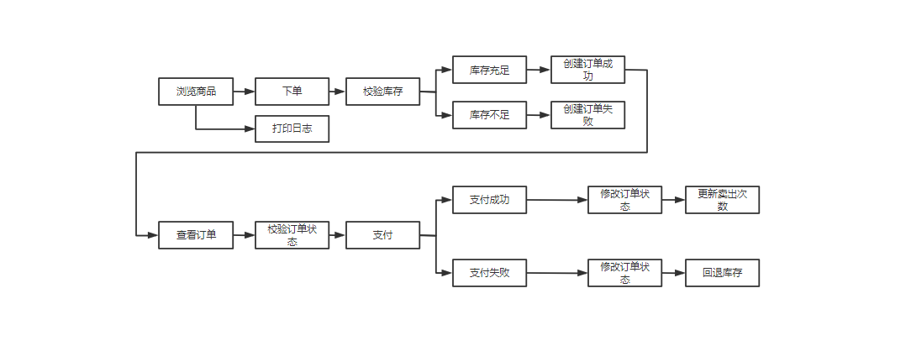
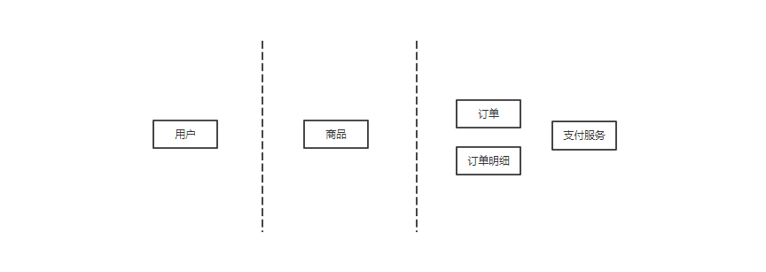
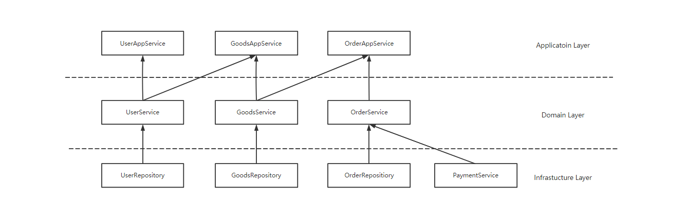

# Micro Service with DDD Case

## 领域驱动

在业务的初期，我们的功能往往都比较简单，普通的CRUD即可满足所有的需求，此时系统是清晰且容易掌控的。 随着迭代的不断进行，业务逻辑会变得越来越复杂，系统也开始变得越来越冗余。
很容易出现，模块与模块间的的界限模糊不清，类与类之间职责不明，修改一个功能(如某个table schema)，会引起诸多意料之外的模块发生问题。 在这种背景下，诞生了许多系统设计理念，如n-layer, Onion, Hexagonal,
领域驱动设计(Domain Driven Design, 下文简称DDD)等系统设计架构。 本文对DDD在这些复杂场景下给出的解法，做出一定的说明与实践。

### 数据驱动的问题

传统WEB开发通常使用三层架构，即用户接口层、业务逻辑层、数据访问层，如下图  


对应到常用的SSM框架，表现为Controller层，Service层，DAO层。 这种架构下主要的问题在于，所有的业务逻辑全在Service层中，不同的业务之间没有明显的解析划分，Service之间的依赖也没有明确的规约。
于是很容易在后期出现Service之间引用混乱，牵一发而动全身的状况。 这时候也许修改一个feature达成需求的成本远远高于重新开发，于是又进一步的降低了模块的复用性，增加耦合性，代码也越发膨胀，失去掌控。

同时，基于Controller、Service、DAO的分层模式，也会很自然的写出过程式的代码，导致很多关于OO的理论便无用武之地。 这种场景下，一个需求的开发往往从ER图开始设计，反复确认完成DB Table
Schema的定义，祈祷Schema不会发生变化。 但在实际的业务场景中，变化是不可避免的，而每次改动DB都会影响到整个系统的逻辑，这对开发人员来说，无疑是灾难性的。

上述问题的本质，其实是在于混淆了数据模型(Data Model)与领域模型(Domain Model)的概念。 在纯依赖数据模型的系统，对象只是数据的载体，没有行为，业务流程会被映射成对数据的移动、处理和实现过程。
在这样的场景下，简单的需求是可以满足的，但在复杂场景中，将会现实业务和代码的直接映射关系，很容易出现，在新增一个feature时，不知道在哪里添加，原系统中似乎有，但好像又不能复用的情况。 以上的问题，在DDD中以领域建模的方式得以解决。

### DDD的基本概念

这里简述DDD的相关概念，详细信息网上描述的太多，这里不再赘述。

#### 实体

拥有业务属性和业务行为的对象，拥有唯一标识，每个实体都是独一无二的存在

#### 值对象

没有唯一标识，通过对象属性值来标识的对象，一般不可修改

#### 聚合根

在一组关联性较高的对象集合中，可作为一个整体被外界访问(内含其他对象的引用)，则称该对象为聚合根，一般为业务上某个重要的实体

#### 领域服务

一些重要的领域行为和操作，用于封装有多实体参与的业务行为

#### 领域事件

在领域内会触发下一阶段业务的行为，一般用于领域间解耦(采用事件通信机制)

### 代码架构

DDD中，一般采用4层分层架构，如下图  


Interface层实现对接外部接口，其中会包含DTO, Assembler, Controller等，DTO为数据传输载体，例如Request, Response. Assembler负责DTO与Entity的转换。  
Application层负责协调和编排各个领域服务、事件消费与发送、定时任务等，其中会包含ApplicationService, EventPublisher, EventListener, Scheduler, DTO(如果需要)
等。  
Domain层包含DomainService, Entity, ValueObject 等，为业务领域对代码领域的映射。   
Infrastructure层为对以上所有层的依赖，例如数据访问，Cache管理，第三方接入，消息管理等等。

以上各层遵循上传仅依赖直属下层的约定，但在实际使用中，往往采用依赖翻转的原则，尽量解耦各层对Infrastructure层的依赖，行程已Domain层为核心的架构，进而将代码核心落在实际业务逻辑中。改造后如下图。  


映射到具体代码为

```
├─adapter               Adapter层
│  ├─mobile             移动端
│  │  ├─assembler       移动端 assembler, 实现DTO与Entity的转换
│  │  ├─dto             移动端DTO, 前端应用数据的传输载体，不实现任何业务逻辑
│  │  └─facade          移动端对外接口，封装应用服务，提供粗粒度的调用接口；或将用户请求委派给一个或多个应用服务
│  └─web                PC端
│      ├─assembler      PC端 assembler, 实现DTO与Entity的转换
│      ├─dto            PC端DTO, 前端应用数据的传输载体，不实现任何业务逻辑
│      └─facade         PC端对外接口，封装应用服务，提供粗粒度的调用接口；或将用户请求委派给一个或多个应用服务
├─application           Application层
│  ├─event              领域事件相关代码，包含事件定义、发布事件、监听事件
│  │  ├─publisher       事件发布相关代码
│  │  └─subscriber      事件订阅相关代码
│  ├─scheduler          计划任务相关代码
│  └─service            应用服务接口
│      └─impl           应用服务实现
├─domain                Domain层
│  ├─entity             存放领域实体代码，包含聚合根、实体、值对象等；实体包含业务属性和业务行为
│  │  └─objectvalue     存放值对象代码
│  ├─gateway            领域层网关接口，存放领域内对外部的依赖接口
│  ├─repository         领域层仓储接口，存放领域层所需的持久化接口
│  └─service            领域服务实现
│      └─impl           领域服务接口，存放领域服务、工厂服务等代码；一个领域服务是由多个实体组合出来的一段业务逻辑；领域服务用来封装多个实体或方法提供上层应用服务的调用
└─infrastructure         Infrastructure层
    ├─config            存放通用配置相关代码
    ├─dao               数据库访问相关代码
    │  ├─entity         存放持久层对象DO，和数据库库表一一对应
    │  ├─factory        工厂相关代码，实现Entity与DO的相互转换
    │  └─mapper         Mybatis Mapper 接口
    ├─gatewayimpl       网关接口实现
    ├─message           存放消息队列相关代码
    ├─repositoryimpl    仓储接口实现
    └─util              存放通用工具类
```

### 工程实现

这里假定一个简单的电商下单结算业务流，并将改流程按DDD思想映射到代码上。假定业务流入下图。    


由于DDD设计中无强制性的规约，所以实际使用中应紧紧贴合具体的业务来划分领域，界限上下文以及实体等。    
这里只做演示，按上图初步估计有用户、商品、订单、订单明细、支付等主要实体。我们按下图分隔成3个领域。  


可以归纳出核心服务间的关系，如下图  


这里举OderAppService的例子来演示服务间如何调用和依赖

#### 应用层

应用层OrderAppService依赖领域层的orderService与goodsService, 并协调他们完成下单流程和支付结果处理

```shell
@Service
public class OrderAppServiceImpl implements OrderAppService {
    @Autowired
    private OrderService orderService;

    @Autowired
    private GoodsService goodsService;
    
    @Override
    public void createOrder(Integer userId, List<Detail> detailList) {
        detailList.forEach(detail -> goodsService.subtractInventory(detail.getGoodsId(), detail.getGoodsNumber()));
        orderService.createOrder(userId, detailList);
    }
    
    @Override
    public void payForOrder(Integer id) {
        Order order = orderService.findById(id);
        if (order == null) {
            throw new RuntimeException(MessageFormat.format("order id not exists: {0}", id));
        }
        if (!Objects.equals(order.getStatus(), Status.CREATED)) {
            throw new RuntimeException(MessageFormat.format("order has been paid: {0}", id));
        }

        if (orderService.payForOrder(order)) {
            order.getDetailList().forEach(detail -> goodsService.addSellCount(detail.getGoodsId()));
        } else {
            order.getDetailList().forEach(detail -> goodsService.addInventory(detail.getGoodsId(), detail.getGoodsNumber()));
            throw new RuntimeException("pay failed");
        }
    }
}
```

#### 领域层

领域层OrderService完成核心的业务流程(创建订单与支付)，并依赖本层所定义的仓储接口OrderRepository与三方支付服务接口PaymentService

```shell
@Service
public class OrderServiceImpl implements OrderService {
    @Autowired
    private OrderRepository orderRepository;

    @Autowired
    private PaymentService paymentService;
    
    @Override
    public void createOrder(Integer userId, List<Detail> detailList) {
        Order order = new Order(userId, detailList);
        orderRepository.saveOrder(order);
    }

    @Override
    public Boolean payForOrder(Order order) {
        Boolean success = paymentService.pay();
        order.setStatus(success ? Status.SUCCESS : Status.FAILED);
        orderRepository.saveOrder(order);
        return success;
    }
}
```

#### 基础设施层

基础设施层反向依赖领域层接口，改成存放与DB直接关联的数据访问服务与三方服务，实现领域层定义的仓储接口OrderRepository与三方支付服务接口PaymentService，实现领域层解耦的效果

```shell
@Service
public class OrderRepositoryImpl implements OrderRepository {
    @Autowired
    private OrderPORepository orderPORepository;

    @Autowired
    private OrderFactory orderFactory;

    @Override
    public void saveOrder(Order order) {
        orderPORepository.save(orderFactory.createOrderPO(order));
    }

    @Override
    public List<Order> findByUserId(Integer userId) {
        return orderPORepository.findByUserId(userId).stream().map(orderFactory::createOrder).collect(Collectors.toList());
    }

    @Override
    public Order findById(Integer id) {
        return orderFactory.createOrder(orderPORepository.findById(id).orElse(null));
    }
}
```

```shell
@Slf4j
@Service
public class PaymentServiceImpl implements PaymentService {
    @Autowired
    private ZhifubaoService zhifubaoService;

    @Override
    public Boolean pay() {
        boolean success = true;
        try {
            zhifubaoService.pay();
        } catch (Exception e) {
            log.error("zhifubao pay failed");
            success = false;
        }
        return success;
    }
}
```

## 微服务

## 分布式事务

## 租赁式数据库
