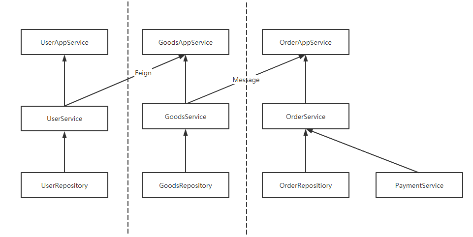
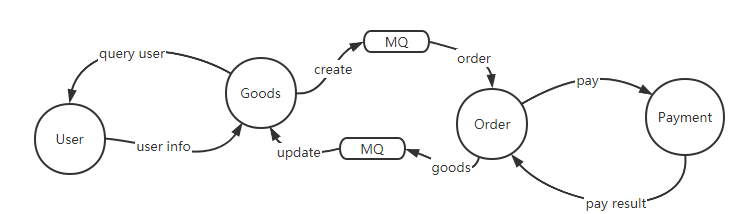

# Micro Service Shop

## Module
- shop-user
- shop-goods
- shop-order

## Service RelationShip


## Communication


## API
### shop-user
- register
```shell
curl --location --request POST 'localhost:2001/user/register?username=rain&password=rain' \
--data-raw ''
```
- login
```shell
localhost:2001/user/login?username=rain&password=rain
```

### shop-goods
- get goods
```shell
curl --location --request GET 'localhost:2002/goods'
```

### shop-order
- create order
```shell
curl --location --request POST 'localhost:2003/order' \
--header 'Content-Type: application/json' \
--data-raw '{
    "userId": 1,
    "detailList": [
        {
            "id": 1,
            "name": "goods-1",
            "price": 11.11,
            "number": 7
        },
        {
            "id": 2,
            "name": "goods-2",
            "price": 22.22,
            "number": 20
        }
    ]
}'
```

- get user's orders
```shell
curl --location --request GET 'localhost:2003/order?userId=1'
```

- pay for order
```shell
curl --location --request POST 'localhost:2003/order/pay?orderId=1'
```